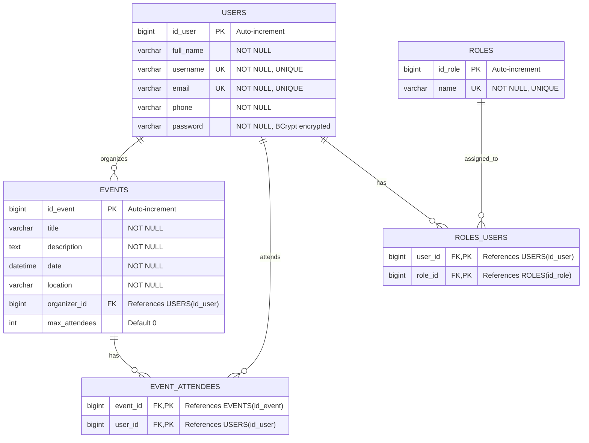

# GijónEventos - Event Management Platform

GijónEventos is an event management platform designed for the city of Gijón. Users can browse, create, and attend local events, fostering community engagement and social connections.

The platform features secure authentication, event management with CRUD operations, and an intuitive interface for both organizers and attendees.

Built with Spring Boot (backend) and React with TypeScript (frontend), GijónEventos provides a modern, responsive experience for event discovery and management.

## 📋 Table of Contents

- [Prerequisites](#prerequisites)
- [Installation](#installation)
- [Configuration](#configuration)
- [Usage](#usage)
- [Database Schema](#database-schema)
- [API Endpoints](#api-endpoints)
- [Project Structure](#project-structure)
- [Running Tests](#running-tests)
- [Tools & Technologies](#tools--technologies)
- [Known Issues](#known-issues)
- [Future Improvements](#future-improvements)
- [Contributors](#contributors)
- [Frontend Repository](#frontend-repository)

---

## 🔧 Prerequisites

Before running this project, ensure you have the following installed:

- **Java 21** or later
- **Maven 3.6+**
- **Docker** and **Docker Compose**
- **Git**

---

## 📦 Installation

### 1. Clone the repository

```bash
git clone https://github.com/saulOMgit/gijoneventos-back.git
cd gijoneventos-back
```

### 2. Start the database with Docker

```bash
docker-compose up -d mysql-db phpmyadmin
```

This will start:
- **MySQL** on `localhost:3307`
- **phpMyAdmin** on `http://localhost:8081`

### 3. Verify MySQL is running

```bash
docker-compose ps
```

You should see `gijoneventos-mysql` with status `Up (healthy)`.

### 4. Initialize the database (first time only)

Edit `src/main/resources/application-mysql.properties`:

```properties
spring.sql.init.mode=always  # Change from 'never' to 'always'
```

### 5. Run the application

```bash
mvn clean spring-boot:run
```

The first run will take longer as Maven downloads dependencies.

### 6. Verify the application is running

Open in your browser:
- **API Events endpoint**: http://localhost:8080/api/v1/events
- **phpMyAdmin**: http://localhost:8081 (user: `root`, password: `rootpassword`)

### 7. After first successful run

Change back in `application-mysql.properties`:

```properties
spring.sql.init.mode=never  # Prevent reinserting data on restart
```

---

## ⚙️ Configuration

### Database Configuration

The application uses MySQL running in Docker. Default configuration:

```properties
# Database connection
spring.datasource.url=jdbc:mysql://localhost:3307/gijoneventos_db
spring.datasource.username=appuser
spring.datasource.password=apppassword

# Hibernate settings
spring.jpa.hibernate.ddl-auto=update
spring.jpa.show-sql=true
```

### Docker Services

The `docker-compose.yml` provides:

- **mysql-db**: MySQL 8.0 database server
- **phpmyadmin**: Web-based MySQL management interface

To modify database credentials, edit the `docker-compose.yml` file.

---

## 🚀 Usage

### Starting the application

```bash
# Start database
docker-compose up -d mysql-db phpmyadmin

# Run Spring Boot application
mvn spring-boot:run
```

### Stopping the application

```bash
# Stop Spring Boot (Ctrl+C in terminal)

# Stop Docker containers
docker-compose down

# To remove volumes and reset database
docker-compose down -v
```

### Default Users

The application comes with pre-configured test users:

| Username | Email | Password | Role |
|----------|-------|----------|------|
| daisy | daisy@example.com | password | ADMIN |
| donald | donald@example.com | password | USER |

---

## 🗄️ Database Schema



### Relationships

- **Users ↔ Roles**: Many-to-Many (a user can have multiple roles, a role can be assigned to multiple users)
- **Users → Events**: One-to-Many (a user can organize multiple events)
- **Users ↔ Events**: Many-to-Many (users can attend multiple events, events can have multiple attendees)

### Key Constraints

- **Username**: Unique identifier for authentication
- **Email**: Must be unique across all users
- **Organizer**: Automatically added as attendee when creating an event
- **Max Attendees**: Event capacity limit enforced on join

---

## 🔌 API Endpoints

Base URL: `http://localhost:8080/api/v1`

### Authentication

| Method | Endpoint | Description | Request Body | Auth Required |
|--------|----------|-------------|--------------|---------------|
| POST | `/register` | Register new user | `RegisterDTORequest` | No |
| GET | `/login` | Login user (Basic Auth) | None (uses Basic Auth header) | Yes (Basic Auth) |

**RegisterDTORequest:**
```json
{
  "fullName": "John Doe",
  "username": "johndoe",
  "email": "john@example.com",
  "phone": "123456789",
  "password": "SecurePass123",
  "confirmPassword": "SecurePass123"
}
```

**Login Response (UserDTOResponse):**
```json
{
  "id": 1,
  "fullName": "John Doe",
  "username": "johndoe",
  "email": "john@example.com",
  "phone": "123456789",
  "role": "ROLE_USER"
}
```

---

### Events

| Method | Endpoint | Description | Request Body | Auth Required |
|--------|----------|-------------|--------------|---------------|
| GET | `/events` | Get all events (with optional filter) | None | Yes |
| POST | `/events` | Create new event | `EventDTORequest` | Yes |
| PUT | `/events/{id}` | Update event | `EventDTORequest` | Yes (Organizer or Admin) |
| DELETE | `/events/{id}` | Delete event | None | Yes (Organizer or Admin) |
| POST | `/events/{id}/join` | Join event as attendee | None | Yes |
| POST | `/events/{id}/leave` | Leave event | None | Yes |

**Query Parameters for GET /events:**
- `filter` (optional): `ALL`, `ATTENDING`, `ORGANIZED`
  - `ALL`: Returns all events (default)
  - `ATTENDING`: Returns events the user is attending
  - `ORGANIZED`: Returns events organized by the user

**EventDTORequest:**
```json
{
  "title": "Concierto de Jazz",
  "description": "Evento musical en el puerto",
  "date": "2025-11-15T21:00:00",
  "location": "Puerto Deportivo de Gijón",
  "maxAttendees": 150
}
```

**EventDTOResponse:**
```json
{
  "id": 1,
  "title": "Concierto de Jazz",
  "description": "Evento musical en el puerto",
  "date": "2025-11-15T21:00:00",
  "location": "Puerto Deportivo de Gijón",
  "organizer": {
    "id": 1,
    "fullName": "Daisy User",
    "username": "daisy",
    "email": "daisy@example.com",
    "phone": "123456789",
    "role": "ROLE_ADMIN"
  },
  "attendees": [1, 2, 3],
  "maxAttendees": 150
}
```

---

### Authorization Rules

- **Create Event**: Any authenticated user
- **Update Event**: Only the organizer or admin
- **Delete Event**: Only the organizer or admin
- **Join/Leave Event**: Any authenticated user
- **View Events**: Any authenticated user (public events viewable by GET without auth)

---

## 📁 Project Structure

```
gijoneventos-back/
│
├── src/
│   ├── main/
│   │   ├── java/
│   │   │   └── dev/
│   │   │       └── saul/
│   │   │           └── gijoneventos/
│   │   │               ├── auth/                     # Authentication
│   │   │               │   ├── AuthController.java
│   │   │               │   └── AuthDTOResponse.java
│   │   │               │
│   │   │               ├── config/                   # Security & Configuration
│   │   │               │   └── SecurityConfiguration.java
│   │   │               │
│   │   │               ├── event/                    # Event Management
│   │   │               │   ├── EventController.java
│   │   │               │   ├── EventService.java
│   │   │               │   ├── EventRepository.java
│   │   │               │   ├── EventEntity.java
│   │   │               │   ├── EventDTORequest.java
│   │   │               │   ├── EventDTOResponse.java
│   │   │               │   └── EventFilter.java
│   │   │               │
│   │   │               ├── register/                 # User Registration
│   │   │               │   ├── RegisterController.java
│   │   │               │   ├── RegisterService.java
│   │   │               │   ├── RegisterServiceImpl.java
│   │   │               │   ├── RegisterValidator.java
│   │   │               │   ├── RegisterMapper.java
│   │   │               │   ├── RegisterDTORequest.java
│   │   │               │   ├── RegisterDTOResponse.java
│   │   │               │   ├── RegisterExceptionHandler.java
│   │   │               │   ├── GlobalExceptionHandler.java
│   │   │               │   └── UserAlreadyExistsException.java
│   │   │               │
│   │   │               ├── role/                     # Role Management
│   │   │               │   ├── RoleEntity.java
│   │   │               │   ├── RoleRepository.java
│   │   │               │   └── RoleService.java
│   │   │               │
│   │   │               ├── security/                 # Security Services
│   │   │               │   ├── JpaUserDetailsService.java
│   │   │               │   └── SecurityUser.java
│   │   │               │
│   │   │               ├── user/                     # User Management
│   │   │               │   ├── UserEntity.java
│   │   │               │   ├── UserRepository.java
│   │   │               │   ├── UserService.java
│   │   │               │   ├── UserDTORequest.java
│   │   │               │   └── UserDTOResponse.java
│   │   │               │
│   │   │               └── GijoneventosApplication.java
│   │   │
│   │   └── resources/
│   │       ├── application.properties              # Main configuration
│   │       ├── application-mysql.properties        # MySQL profile
│   │       └── data.sql                            # Initial data seed
│   │
│   └── test/
│       └── java/                                   # Unit and integration tests
│
├── docker-compose.yml                              # Docker services
├── pom.xml                                         # Maven dependencies
├── .gitignore
└── README.md
```

### Architecture Highlights

**Layered Architecture:**
- **Controllers**: Handle HTTP requests and responses
- **Services**: Business logic and transaction management
- **Repositories**: Data access layer (Spring Data JPA)
- **Entities**: Domain models
- **DTOs**: Data Transfer Objects for API communication

**Security:**
- BCrypt password encryption
- Basic Authentication with Spring Security
- Role-based access control (RBAC)
- CORS configuration for frontend integration

---

## 🧪 Running Tests

To run the test suite:

```bash
mvn test
```

This will execute all unit and integration tests in the `src/test/` directory.

**Important Notes:**
- Ensure Docker MySQL is running before running integration tests
- Test results are available in `target/surefire-reports/`

---

## 🛠️ Tools & Technologies

### Backend
- **Java 21** - Programming language
- **Spring Boot 3.5.6** - Application framework
  - **Spring Web** - RESTful API
  - **Spring Data JPA** - Database access and ORM
  - **Spring Security** - Authentication and authorization
  - **Spring OAuth2 Resource Server** - OAuth2 support
- **Hibernate 6.6** - ORM implementation
- **Hibernate Validator 8.0.1** - Bean validation
- **MySQL 8.0** - Relational database
- **H2 Database** - In-memory database for testing
- **BCrypt** - Password encryption

### Development Tools
- **Maven** - Build automation and dependency management
- **Lombok** - Reduce boilerplate code
- **Spring Boot DevTools** - Hot reload and development utilities
- **HikariCP** - High-performance JDBC connection pooling
- **Docker & Docker Compose** - Containerization and orchestration

### Testing
- **Spring Boot Test** - Testing framework
- **Spring Security Test** - Security testing utilities
- **JUnit 5** - Unit testing framework
- **Mockito** - Mocking framework

### Frontend
- **React 18** - UI library
- **TypeScript** - Type-safe JavaScript
- **Vite** - Build tool and dev server

### Version Control
- **Git** - Source control
- **GitHub** - Code hosting and collaboration

---

## ⚠️ Known Issues

Currently, there are no known critical issues. If you encounter any problems, please open an issue on GitHub.

---

## 🚧 Future Improvements

Planned features and enhancements:

- [ ] **Event Categories**: Add categories/tags for better event organization
- [ ] **Image Upload**: Allow event organizers to upload event images
- [ ] **Email Notifications**: Send email confirmations when users join events
- [ ] **Event Search**: Advanced search with filters by date, location, category
- [ ] **Event Ratings**: Allow attendees to rate and review events
- [ ] **Admin Dashboard**: Comprehensive admin panel for platform management
- [ ] **API Documentation**: Integrate Swagger/OpenAPI for interactive API docs
- [ ] **Social Features**: Share events on social media platforms

---

## 👥 Contributors

### Backend Development
- **Saúl** - [GitHub](https://github.com/saulOMgit)

---

## 🎨 Frontend Repository

The frontend for this project is built with React and TypeScript.

**Frontend Repo**: [GijónEventos Frontend](https://github.com/saulOMgit/GijonEventosFrontend)

---

## 📄 Disclaimer

This project is developed as part of a bootcamp learning experience at **Factoría F5 Asturias** and is intended for educational purposes only.

The creators and contributors are not responsible for any issues, damages, or losses that may occur from using this code. This project is not meant for commercial use.

By using this code, you acknowledge that it is a work in progress, created by learners, and comes without warranties or guarantees of any kind.

**Use at your own discretion and risk.**

---

## ❤️ Thank You!

Thank you for checking out GijónEventos! If you find this project useful, please consider giving it a ⭐ on GitHub.

For questions or suggestions, feel free to open an issue or reach out to the contributors.

---

**Happy Coding! 🚀**
